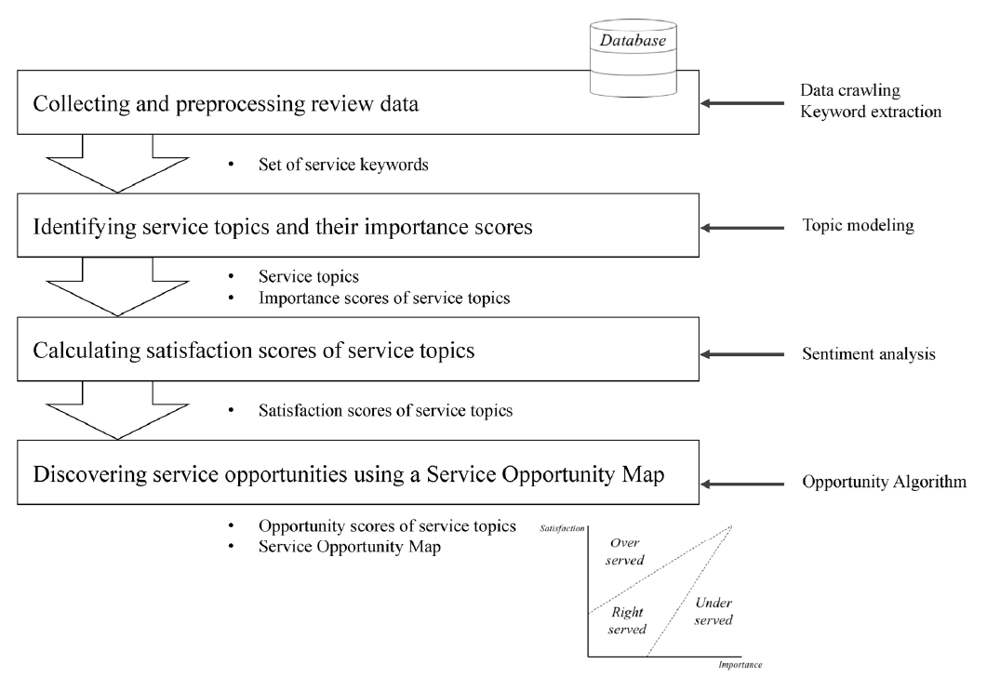
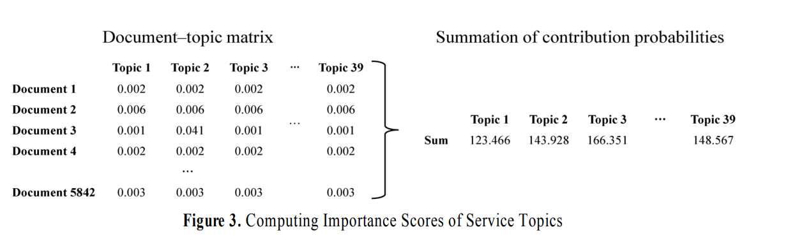
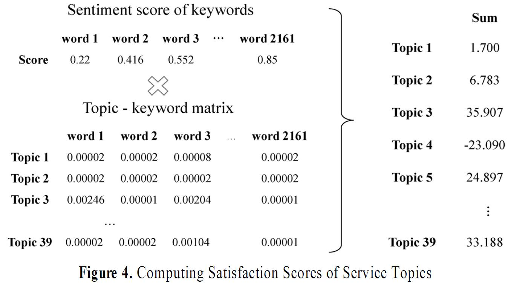
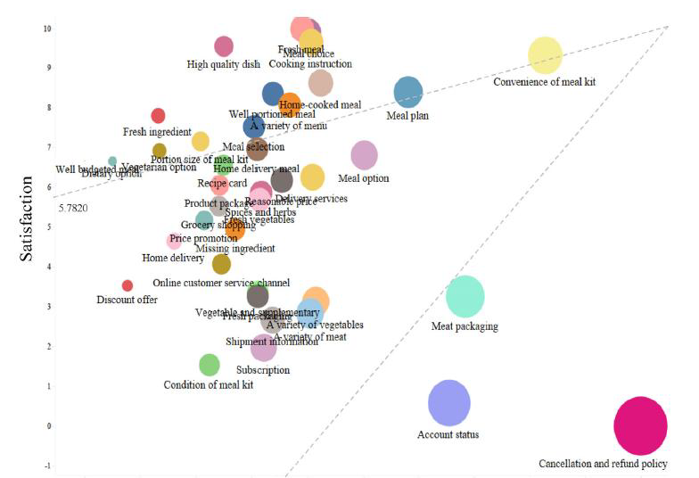

This page reviews a paper published by the **Business Intelligence and Data Analytics Lab** at Konkuk University, Seoul, Korea. This review is written for study and documentation purposes.

> **Reference:**\
> Jeong Jaeyeon, Jiho Lee and Janghyeok Yoon. (2023). Service Opportunity Discovery Via Review Mining of Meal Kit Delivery Service. *Journal of the Korean Institute of Industrial Engineers*, 49(2), 142-156.
>
> 정재연, 이지호 and 윤장혁. (2023). 밀키트 구독서비스의 리뷰 마이닝을 통한 서비스 기회 발굴. *대한산업공학회지*, 49(2), 142-156.

## 1. Research Overview

### Background and Objective

Existing research on meal kit subscription services has been limited to presenting single keywords, which fails to consider the context of consumer feedback. Accordingly, this study aims to discover new product opportunities by utilizing quantitative metrics based on **Review Mining**.

### Analysis Process

The research proceeds through the following four-step process:

1.  **Data Collection & Preprocessing:** Crawling review data and extracting keywords.

2.  **Topic Modeling (LDA):** Identifying service topics and calculating Importance scores.

3.  **Sentiment Analysis:** Calculating Satisfaction scores through keyword sentiment analysis.

4.  **Opportunity Discovery:** Constructing a Service Opportunity Map and identifying opportunity areas.

    

------------------------------------------------------------------------

## 2. Detailed Methodology

### A. Data Preprocessing and Keyword Extraction

Using the RAKE algorithm, an initial set of 24,337 keywords was extracted. After removing stopwords (numbers, special characters, etc.) and filtering for adjectives/adverbs, a final set of **2,161 keywords** related to subscriptions was selected.

### B. Topic Identification (Topic Modeling)

The LDA (Latent Dirichlet Allocation) algorithm was used to identify topics. To determine the optimal number of topics ($K$), the **Elbow Method** was employed. This method selects the point where cosine similarity decreases (indicating higher independence) as the number of topics increases.

```{python}
#| label: fig-elbow
#| fig-cap: "Elbow Method Example (Distortion Score) - Python Implementation"
#| echo: true
#| warning: false

import matplotlib.pyplot as plt

k = list(range(1, 11))
distortion = [1300, 1000, 800, 700, 650, 600, 580, 550, 520, 500]

plt.figure(figsize=(8, 5))
plt.plot(k, distortion, marker='o', linestyle='-', color='blue')
plt.title('Elbow Method')
plt.xlabel('Number of clusters')
plt.ylabel('Distortion')
plt.grid(True)
plt.show()
```

### C. Metric Calculation: Importance & Satisfaction

This study quantifies "Importance" and "Satisfaction" using the probability distributions derived from Topic Modeling and Sentiment Analysis.

#### **1. Importance Score**

Importance determines how heavily a topic is discussed by customers. It is calculated by summing the topic contribution probabilities ($P(z_k|d)$) across all documents in the **Document-Topic Matrix**.

$$ \text{Importance}(z_k) = \sum_{d \in D} P(z_k | d) $$

-   **Logic:** A topic mentioned frequently across many reviews is considered a critical service element.

-   **Normalization:** The raw sum is normalized to a scale of **0 to 10** using Min-Max Normalization.

    

#### **2. Satisfaction Score**

Satisfaction reflects the customer's sentiment toward a specific topic. It is calculated by integrating sentiment analysis with the **Topic-Keyword Matrix** ($P(w|z_k)$).

-   **Step 1: Keyword Sentiment (**$S_w$)\
    Since the same word can have different meanings depending on context, the sentiment score of a keyword $w$ is defined as the **average sentiment score of all sentences** containing that keyword. $$ S_w = \frac{1}{|Sent_w|} \sum_{s \in Sent_w} \text{Sentiment}(s) $$ *(where* $Sent_w$ is the set of sentences containing word $w$)

-   **Step 2: Topic Satisfaction (**$TS_k$)\
    The satisfaction of a topic $z_k$ is the weighted sum of the sentiment scores of its keywords, weighted by the keyword's probability within that topic. $$ TS(z_k) = \sum_{w \in W} \left( S_w \times P(w | z_k) \right) $$

-   **Normalization:** Like importance, the final satisfaction score is normalized to a scale of **0 to 10**.

    

### D. Service Opportunity Map

Service topics are diagnosed by plotting them on axes of **Importance** and **Satisfaction**.

-   **Under-served:** Areas with high Importance but low Satisfaction. These represent key improvement opportunities.
-   **Over-served:** Areas with low Importance but excessively high Satisfaction.
-   **Right-served:** Areas where Importance and Satisfaction are balanced.

> **Opportunity Score Algorithm:** $$Opportunity = Importance + max(Importance - Satisfaction, 0)$$

The size of the circle in the map is proportionate to the Opportunity Score.



------------------------------------------------------------------------

## 3. Theoretical Background: pLSA

### pLSA (Probabilistic Latent Semantic Analysis)

pLSA is a latent variable model that associates unobserved class variables (topics, $z \in Z$) with observed data (documents $d \in D$ and words $w \in W$). The joint probability model (Symmetric formulation) is defined as:

$$P(d, w) = \sum_{z \in Z} P(z) P(d|z) P(w|z)$$

To estimate the parameters $\theta = \{P(z), P(d|z), P(w|z)\}$, we aim to maximize the Likelihood of the observed data.

### 1. Likelihood Function ($L$)

Assuming the data is independent and identically distributed (i.i.d.), the total likelihood $L$ is the product of the probabilities of all observed document-word pairs $(d, w)$ occurring $n(d, w)$ times:

$$L = \prod_{d \in D} \prod_{w \in W} P(d, w)^{n(d, w)}$$

Substituting the generative model into the likelihood:

$$L = \prod_{d \in D} \prod_{w \in W} \left( \sum_{z \in Z} P(z) P(d|z) P(w|z) \right)^{n(d, w)}$$

### 2. Log-Likelihood Function ($\mathcal{L}$)

Since maximizing a product is computationally difficult, we maximize the log-likelihood $\mathcal{L}$. The logarithm is a monotonic function, so the maximum location remains unchanged.

$$\mathcal{L} = \log L = \sum_{d \in D} \sum_{w \in W} n(d, w) \log P(d, w)$$

$$\mathcal{L} = \sum_{d \in D} \sum_{w \in W} n(d, w) \log \left( \sum_{z \in Z} P(z) P(d|z) P(w|z) \right)$$

**Problem:** The summation $\sum_{z}$ exists inside the logarithm. This makes direct maximization via partial derivatives intractable because the parameters are coupled. To solve this, we use the **EM Algorithm**.

### 3. Derivation of the Surrogate Function (Q-Function)

Direct maximization of $\mathcal{L}$ is difficult due to the summation inside the logarithm. To overcome this, we employ the **EM algorithm**, which iteratively maximizes a lower bound of the log-likelihood constructed using **Jensen's Inequality**.

#### **A. Constructing the Lower Bound**

Let $\theta$ be the current parameters and $\theta^{(t)}$ be the parameters from the previous iteration. We introduce the posterior probability of the latent variable $z$, denoted as $P(z|d,w)^{(t)}$, which sums to 1 over $z$ ($\sum_z P(z|d,w)^{(t)} = 1$).

We can rewrite the log-likelihood by multiplying and dividing by this probability term:

$$
\begin{aligned}
\mathcal{L} &= \sum_{d} \sum_{w} n(d, w) \log \left( \sum_{z} P(z, d, w) \right) \\
&= \sum_{d} \sum_{w} n(d, w) \log \left( \sum_{z} P(z|d,w)^{(t)} \frac{P(z) P(d|z) P(w|z)}{P(z|d,w)^{(t)}} \right)
\end{aligned}
$$

#### **B. Applying Jensen's Inequality**

Since the logarithm function $\log(x)$ is strictly **concave**, Jensen's Inequality states that the log of the expectation is greater than or equal to the expectation of the log ($\log E[X] \ge E[\log X]$).

Applying this to the equation above:

$$
\begin{aligned}
\mathcal{L} &\ge \sum_{d} \sum_{w} n(d, w) \sum_{z} P(z|d,w)^{(t)} \log \left( \frac{P(z) P(d|z) P(w|z)}{P(z|d,w)^{(t)}} \right) \\
&= \mathcal{B}(\theta, \theta^{(t)}) \quad (\text{Evidence Lower Bound})
\end{aligned}
$$

Here, $\mathcal{B}(\theta, \theta^{(t)})$ serves as the **Lower Bound** for the true log-likelihood.

#### **C. Defining the Q-Function**

We expand the Lower Bound:

$$
\mathcal{B}(\theta, \theta^{(t)}) = \sum_{d,w} n(d,w) \sum_{z} P(z|d,w)^{(t)} \left[ \log \big( P(z)P(d|z)P(w|z) \big) - \log P(z|d,w)^{(t)} \right]
$$

The second term, $-\sum P(z|d,w)^{(t)} \log P(z|d,w)^{(t)}$, depends only on the old parameters $\theta^{(t)}$ and is constant with respect to $\theta$. Therefore, maximizing the Lower Bound is equivalent to maximizing the first term, which we define as the **Q-function**:

$$Q(\theta, \theta^{(t)}) = \sum_{d \in D} \sum_{w \in W} n(d, w) \sum_{z \in Z} P(z|d, w)^{(t)} \log \left( P(z) P(d|z) P(w|z) \right)$$

In the **M-step**, we maximize this $Q$-function to find the optimal $\theta$.

### 4. EM Algorithm Steps

The EM algorithm alternates between estimating the latent variables (E-step) and optimizing the parameters (M-step) until convergence.

#### **A. E-Step (Expectation): Posterior Probability Estimation**

In this step, we assume the current parameters $\theta^{(t)}$ are fixed. We calculate the posterior probability that an observed occurrence of word $w$ in document $d$ originated from topic $z$. This posterior probability, $P(z|d, w)$, serves as a "soft assignment" or weight.

Applying Bayes' Theorem:

$$P(z|d, w)^{(t+1)} = \frac{P(z)^{(t)} P(d|z)^{(t)} P(w|z)^{(t)}}{\sum_{z' \in Z} P(z')^{(t)} P(d|z')^{(t)} P(w|z')^{(t)}}$$

#### **B. M-Step (Maximization): Parameter Update**

In this step, we update the parameters $\theta^{(t+1)}$ to maximize the $Q$-function calculated in the E-step. Since these parameters represent probabilities, they must satisfy the normalization constraints (i.e., they must sum to 1).

We solve this constrained optimization problem using **Lagrange Multipliers**.

**1) Updating Topic-Word Distribution** $P(w|z)$ \* **Constraint:** $\sum_{w \in W} P(w|z) = 1$ \* **Update Rule:** $$P(w|z)^{(t+1)} = \frac{\sum_{d \in D} n(d, w) P(z|d, w)^{(t+1)}}{\sum_{w' \in W} \sum_{d \in D} n(d, w') P(z|d, w')^{(t+1)}}$$

**2) Updating Topic-Document Distribution** $P(d|z)$ \* **Constraint:** $\sum_{d \in D} P(d|z) = 1$ \* **Update Rule:** $$P(d|z)^{(t+1)} = \frac{\sum_{w \in W} n(d, w) P(z|d, w)^{(t+1)}}{\sum_{d' \in D} \sum_{w \in W} n(d', w) P(z|d', w)^{(t+1)}}$$

**3) Updating Topic Prior** $P(z)$ \* **Constraint:** $\sum_{z \in Z} P(z) = 1$ \* **Update Rule:** $$P(z)^{(t+1)} = \frac{\sum_{d \in D} \sum_{w \in W} n(d, w) P(z|d, w)^{(t+1)}}{\sum_{d \in D} \sum_{w \in W} n(d, w)}$$

The E-step and M-step are repeated iteratively until the increase in the log-likelihood falls below a predefined threshold ($\epsilon$).

------------------------------------------------------------------------

## 4. Practical Implementation: pLSA with Python

To bridge the gap between theory and practice, we implement a topic modeling experiment using a small synthetic corpus. This experiment demonstrates how the model distinguishes between **IT**, **Economy**, and **Food** topics, and how it handles documents with mixed topics.

### A. Environment Setup & Data Preparation

We construct a Term-Document Matrix ($n(d,w)$) from a list of documents. `doc_8` ("Python code for stock market analysis") is intentionally designed to contain keywords from both IT and Economy topics to test the model's soft-clustering capabilities.

```{python}
#| label: data-prep
#| echo: true
#| warning: false

import pandas as pd
from sklearn.feature_extraction.text import CountVectorizer
from sklearn.decomposition import NMF

documents = [
    "Python code is simple and easy",
    "I like python programming language",
    "computer memory and cpu execution",
    "Stock market price is going up",
    "Invest money in the future market",
    "Wall street analyzes the stock price",
    "Apple banana and peach salad",
    "I like to eat apple and banana",
    "Python code for stock market analysis"
]

vectorizer = CountVectorizer(stop_words='english')
dtm = vectorizer.fit_transform(documents)
feature_names = vectorizer.get_feature_names_out()

df_dtm = pd.DataFrame(dtm.toarray(), columns=feature_names, 
                      index=[f"doc_{i}" for i in range(len(documents))])

print("=== 1. 입력 데이터: n(d,w) 행렬 (Term-Document Matrix) ===")
print(df_dtm)
print("\n" + "="*60 + "\n")
```

### B. Topic Modeling using NMF (pLSA Equivalent)

```{python}
#| label: plsa-model
#| echo: true
#| warning: false

n_topics = 3
nmf_model = NMF(n_components=n_topics, solver='mu', 
                beta_loss='kullback-leibler', random_state=42, init='random')
nmf_model.fit(dtm)

print(f"=== 2. 학습 결과: P(w|z) (토픽별 주요 단어) ===")
print("각 토픽에서 확률(가중치)이 높은 상위 3개 단어:\n")

components_df = pd.DataFrame(nmf_model.components_, columns=feature_names)
for topic_idx, topic in enumerate(nmf_model.components_):
    top_words_idx = topic.argsort()[:-4:-1]
    top_words = [feature_names[i] for i in top_words_idx]
    print(f"Topic {topic_idx}: {top_words}")

print("\n" + "="*60 + "\n")
```

### C. Document-Topic Distribution: P(z\|d)

```{python}
#| label: doc-topic-dist
#| echo: true
#| warning: false

print(f"=== 3. 학습 결과: P(z|d) (문서가 어떤 주제인가?) ===")
print("각 문서가 각 토픽에 속할 확률:\n")

doc_topic_dist = nmf_model.transform(dtm)
doc_topic_df = pd.DataFrame(doc_topic_dist, 
                            columns=[f"Topic {i}" for i in range(n_topics)],
                            index=[f"doc_{i}" for i in range(len(documents))])

print(doc_topic_df.round(3))
print("\n" + "="*60 + "\n")
```

### D. Interpretation of Results

```{python}
#| label: interpretation
#| echo: true
#| warning: false

print("=== 4. 문서별 주제 해석 ===\n")

for doc_idx in range(len(documents)):
    probabilities = doc_topic_df.iloc[doc_idx]
    main_topic = probabilities.idxmax()
    main_prob = probabilities.max()
    
    print(f"doc_{doc_idx}: '{documents[doc_idx]}'")
    print(f"  → Primary Topic: {main_topic} (확률: {main_prob:.3f})")
    print()

print("="*60 + "\n")

print("=== 5. 혼합 토픽 문서(doc_8) 분석 ===")
target_idx = 8
print(f"문서: '{documents[target_idx]}'")
print(f"확률 분포: {doc_topic_df.iloc[target_idx].round(3).to_dict()}")
```

------------------------------------------------------------------------

## 5. Key Takeaways

### Importance of Keyword Filtering

The implementation demonstrates a critical challenge inherent in topic modeling: the resulting topic-keyword matrices frequently contain adjectives and adverbs that lack semantic relevance to the extracted topics. To address this limitation, **domain-specific keyword pre-filtering is essential**—researchers should manually curate keyword sets prior to topic extraction to ensure topical coherence and interpretability of the final results.

## 6. References

-   Jeong, J., Lee, J., & Yoon, J. (2023). Service Opportunity Discovery Via Review Mining of Meal Kit Delivery Service. *Journal of the Korean Institute of Industrial Engineers*, 49(2), 142-156.
-   Hofmann, T. (1999). Probabilistic Latent Semantic Indexing. *Proceedings of the 22nd Annual International ACM SIGIR Conference*.
-   Scikit-learn Documentation: https://scikit-learn.org/stable/modules/generated/sklearn.decomposition.NMF.html